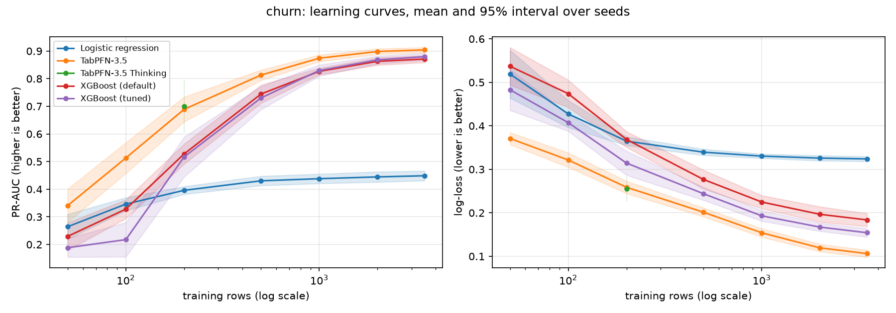
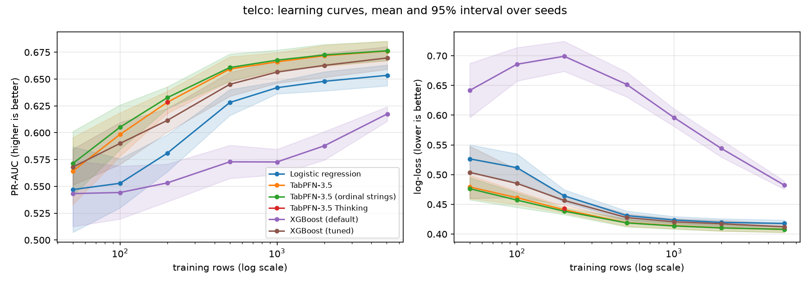

# revbench: can a new subscription app run a retention experiment on day one?

A churn benchmark for **TabPFN-3.5**, a value-vs-budget simulation, and a small agent demo.
Entry for the Prior Labs hackathon.

A new app has few labelled customers. This repo measures how few it can get away with.

> On churn, TabPFN-3.5 trained on 200 rows reaches PR-AUC 0.689. Tuned XGBoost needs 500 rows to
> match it. On Telco it is 0.628, and again 500 rows. The grid is coarse, so read this as
> "at most 2.5x the data".




## Run it in 5 minutes

Needs [uv](https://docs.astral.sh/uv/). These four need no token. Only `make setup` needs the network.

```bash
make setup     # install dependencies
make report    # rebuild results/summary.md and figures from the committed results
make demo      # agent demo, replaying committed TabPFN scores; answer y or n at the approval prompt
make test      # lint + 85 tests
```

To re-run models yourself you need a TabPFN token (`TABPFN_TOKEN` in a `.env` file, which is gitignored):

```bash
make data              # fetch the two OpenML cohorts into data/ (gitignored)
make benchmark-quick   # Telco, n = 50/200/1000, 2 seeds -> results/quick/telco.csv
make value             # re-derive results/value.csv (needs cached predictions from the full sweep)
make demo-live         # the agent scores customers live with 5 TabPFN draws
```

Cost note: the hosted API is metered in tokens. A plain TabPFN call is about 10k tokens.
`benchmark-quick` makes 12 of them (about 120k tokens: TabPFN and the ordinal arm, 3 sizes x 2 seeds). The Thinking arm costs about 20x
more per call and is not in the default arms; opt in with `--arms`.

## What is in it

| Piece | What it does | Output |
|---|---|---|
| Benchmark (`src/revbench/run.py`) | Learning curves, n = 50 to full pool, 10 seeds, two cohorts, six arms | `results/raw/*.csv` |
| Report (`report.py`) | Mean and t-interval per cell, calibration (ECE), timing, ablations, computed headline | `results/summary.md`, `results/figures/` |
| Value simulation (`value.py`) | Net value of targeting the top-k scored customers at 5 to 50% budgets | `results/value.csv` |
| Agent demo (`demo/agent.py`) | Reads a trigger, scores customers, drafts an experiment, asks for approval, rolls out 10% | `.demo/registry.json` |

## Results and honest limitations

Full tables are in [`results/summary.md`](results/summary.md). At n = 200:

| PR-AUC | churn | telco |
|---|---|---|
| TabPFN-3.5 | 0.689 | 0.628 |
| TabPFN-3.5 Thinking (5 seeds) | 0.700 | 0.629 |
| XGBoost, tuned (10 s budget) | 0.517 | 0.611 |
| XGBoost, default | 0.528 | 0.553 |
| Logistic regression | 0.396 | 0.581 |

Limits you should know about:

- **Telco is close.** The confidence bands overlap heavily at n = 200, and I did not run a paired test on the XGBoost gap. The clear win is on churn.
- **Thinking mode is not worth it here.** +0.011 on churn and +0.001 on Telco (unpaired, 5 seeds against 10), at about 20x the token cost.
- **Raw strings did not beat ordinal encoding.** Ordinal minus raw is +0.004 at n = 200 and shrinks to +0.0002 at the full pool. The raw-string path works, but it is not a win.
- **Tuned XGBoost is worse than default at small n on churn** (0.517 vs 0.528). Its tuning budget is 10 s of wall clock, so it depends on the machine.
- **Default XGBoost is badly calibrated on Telco** (ECE 0.151 at n = 200). Calibration is shown as ECE against n, not as reliability curves.
- **The value curves are a simulation, not an outcome.** Offer cost 50, churn-cohort customer value 600 (placeholders), Telco value MonthlyCharges x 12, save rates 10/20/30%. No confidence bands.
- **The demo guardrails are text only,** and it scores a single Telco split. Uncertainty is the spread over 5 draws, each trained on its own 200-row sample.
- Only the hosted API was used. No local GPU.

## Method

- Cohorts (see [`DATASETS.md`](DATASETS.md)): OpenML 40701 (5,000 rows, 14.1% churn) and 42178 (Telco, 7,043 rows, 26.5% churn). Both are public. `make data` downloads them from OpenML (no account needed) into `data/`, and the files are hash-pinned in `data/manifest.json`.
- Split: stratified 30% test set capped at 2,000 rows. Training sets are nested stratified subsamples with at least 5 positives, at n = 50, 100, 200, 500, 1000, 2000 and the full pool.
- Metric: PR-AUC first, then ROC-AUC, log-loss and ECE. Predictions are cached per cell, so reruns cost nothing.
- TabPFN-3.5 is used through the hosted `tabpfn-client`, with string and missing-value columns passed in raw. Telco also has an ordinal-encoded arm as an ablation.
- The demo's offline mode replays `demo/replay/telco_scores.csv`, which is committed and self-contained.

## RevAgent

This is the small, public-data version of an idea from RevAgent, a production-shaped retention agent.
RevAgent: https://github.com/mzdwedar/RevAgent

The full write-up of the idea, thesis, experiment and results is in [`docs/REPORT.md`](docs/REPORT.md).

## Licence

Code is Apache-2.0 (see `LICENSE`). TabPFN-3.5 is accessed through the Prior Labs API under its own terms,
and the datasets keep their OpenML licences.
