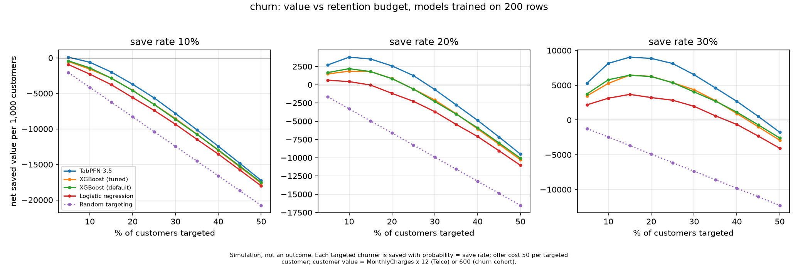
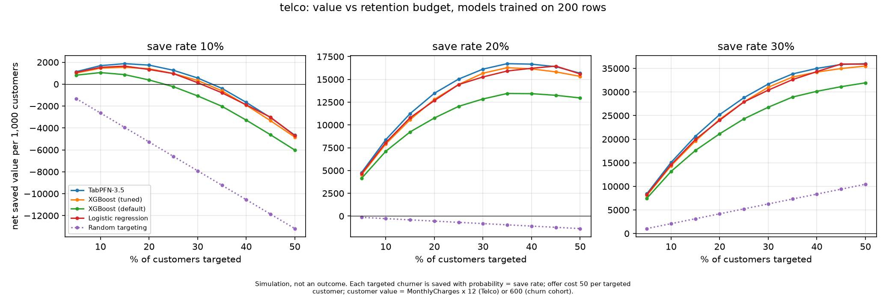

# Results summary

_Generated by `make report` from `results/raw/*.csv`._

## churn

**On churn, TabPFN-3.5 trained on 200 rows reaches PR-AUC 0.689; XGBoost (tuned) needs 500 rows (2.5x the data) to match it.**

### Metrics at n = 200

| arm | seeds | PR-AUC | ROC-AUC | log-loss | ECE | seconds |
|---|---|---|---|---|---|---|
| Logistic regression | 10 | 0.396 | 0.774 | 0.365 | 0.044 | 0.0 |
| TabPFN-3.5 | 10 | 0.689 | 0.883 | 0.259 | 0.032 | 3.7 |
| TabPFN-3.5 Thinking | 5 | 0.700 | 0.883 | 0.255 | 0.027 | 7.6 |
| XGBoost (default) | 10 | 0.528 | 0.835 | 0.369 | 0.068 | 0.1 |
| XGBoost (tuned) | 10 | 0.517 | 0.828 | 0.314 | 0.041 | 10.3 |

### Time to model at the full pool (n = 3,500)

| arm | seconds |
|---|---|
| Logistic regression | 0.0 |
| TabPFN-3.5 | 6.2 |
| XGBoost (default) | 0.2 |
| XGBoost (tuned) | 10.8 |

## telco

**On telco, TabPFN-3.5 trained on 200 rows reaches PR-AUC 0.628; XGBoost (tuned) needs 500 rows (2.5x the data) to match it.**

### Metrics at n = 200

| arm | seeds | PR-AUC | ROC-AUC | log-loss | ECE | seconds |
|---|---|---|---|---|---|---|
| Logistic regression | 10 | 0.581 | 0.810 | 0.464 | 0.050 | 0.0 |
| TabPFN-3.5 | 10 | 0.628 | 0.826 | 0.441 | 0.031 | 5.2 |
| TabPFN-3.5 (ordinal strings) | 10 | 0.633 | 0.828 | 0.439 | 0.031 | 5.5 |
| TabPFN-3.5 Thinking | 5 | 0.629 | 0.824 | 0.443 | 0.036 | 12.9 |
| XGBoost (default) | 10 | 0.553 | 0.772 | 0.699 | 0.151 | 0.1 |
| XGBoost (tuned) | 10 | 0.611 | 0.813 | 0.457 | 0.043 | 10.4 |

### Time to model at the full pool (n = 5,043)

| arm | seconds |
|---|---|
| Logistic regression | 0.0 |
| TabPFN-3.5 | 6.8 |
| TabPFN-3.5 (ordinal strings) | 12.4 |
| XGBoost (default) | 0.2 |
| XGBoost (tuned) | 10.7 |

## Value vs retention budget

_Simulation, not an outcome. Each targeted churner is saved with probability = save rate; offer cost 50 per targeted customer; customer value = MonthlyCharges x 12 (Telco) or 600 (churn cohort)._

## Ablation: raw strings vs ordinal encoding (PR-AUC, paired by seed)

| dataset | n_train | mean_diff | 95% +/- |
|---|---|---|---|
| telco | 50 | +0.0071 | 0.0085 |
| telco | 100 | +0.0067 | 0.0065 |
| telco | 200 | +0.0043 | 0.0037 |
| telco | 500 | +0.0014 | 0.0023 |
| telco | 1000 | +0.0016 | 0.0012 |
| telco | 2000 | +0.0007 | 0.0006 |
| telco | 5043 | +0.0002 | 0.0007 |

## Errors

0 of 640 cells failed.
